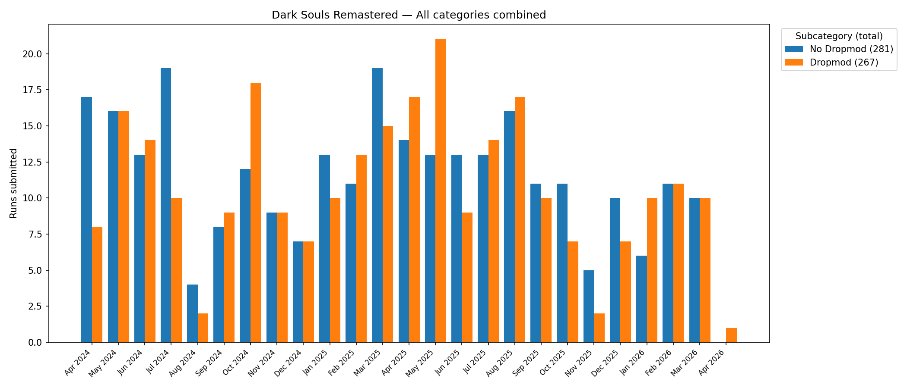
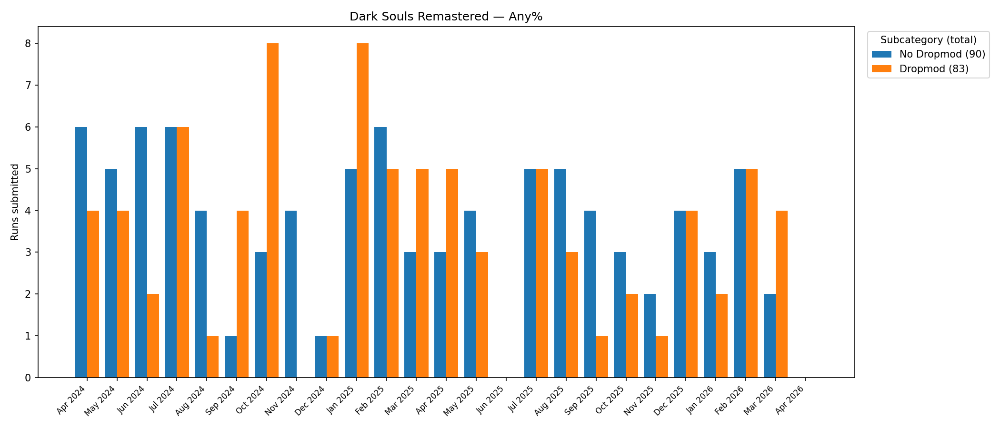
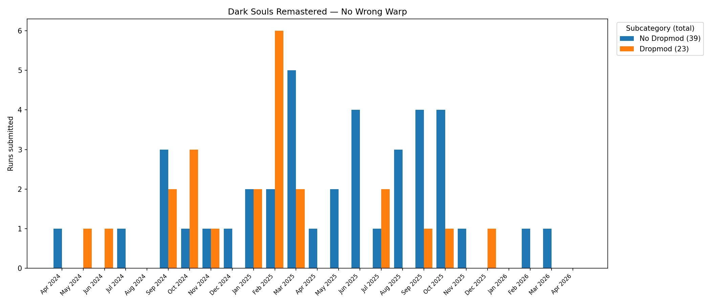
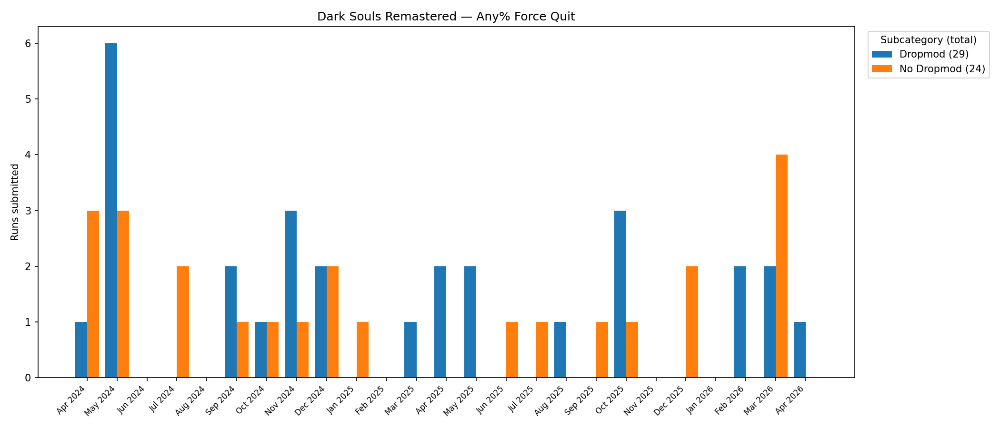
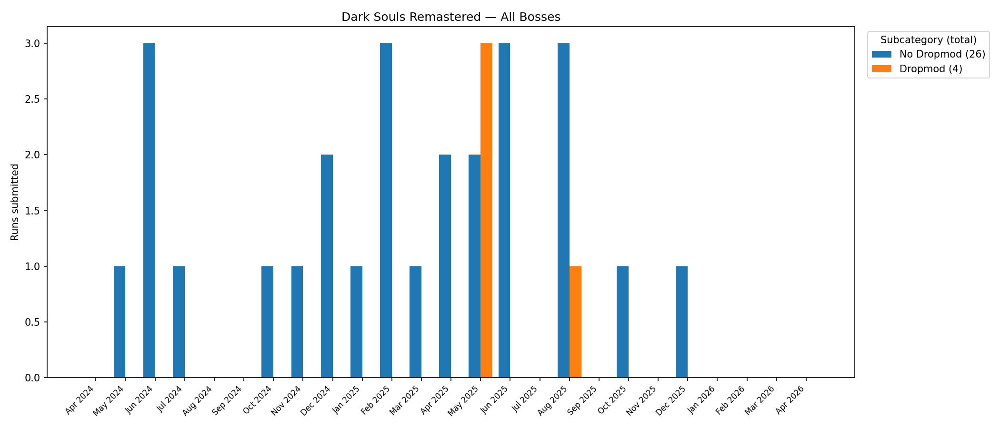
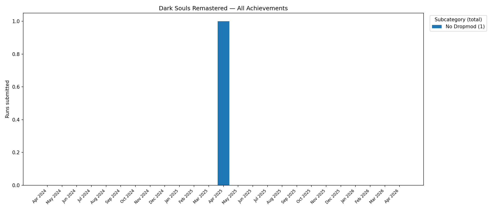
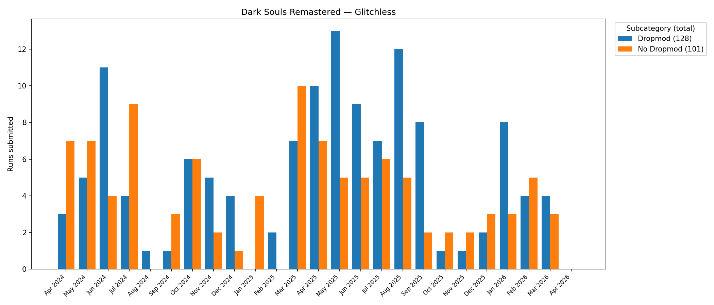
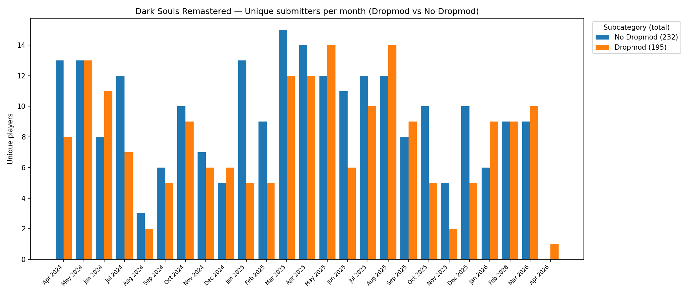
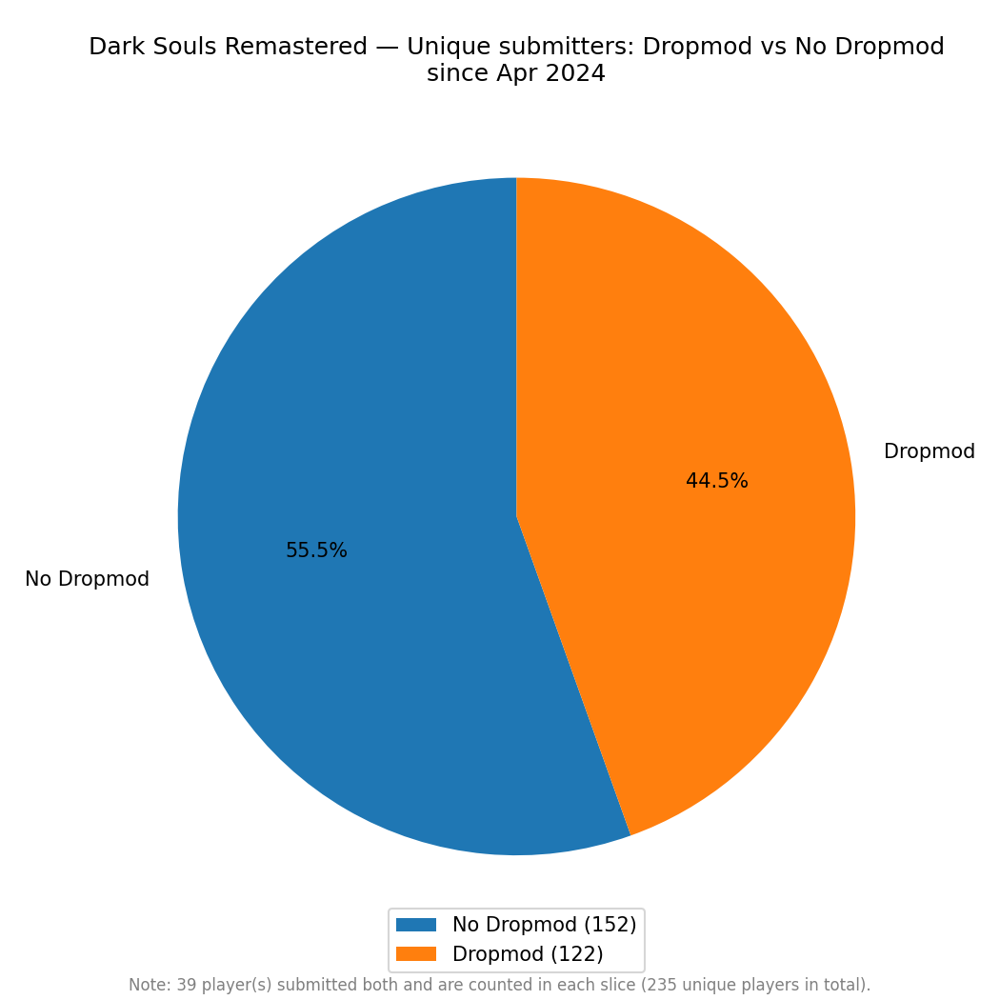
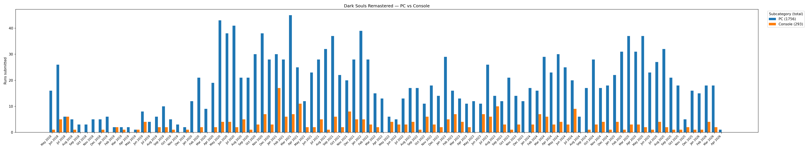

# Dark Souls Remastered — Speedrun Category Popularity Stats

> **Disclaimer:** This code is heavily vibe coded. Don't take the implementation too seriously.

Fetches all verified speedrun submissions for **Dark Souls Remastered** from the [speedrun.com API](https://www.speedrun.com/api) and plots monthly run counts per category, broken down by **Dropmod vs No Dropmod** and **PC vs Console**.

## What it does

- Fetches every verified run across all categories going back to the game's release on 2018-05-25
- Dropmod/No Dropmod charts start from the month of the very first Dropmod run, so the charts aren't padded with empty space
- Produces one bar chart per dropmod-eligible category, a combined chart across all those categories, and a PC vs Console chart covering all categories from release
- Saves all plots as PNG files in the `plots/` directory
- Exports all runs to a CSV file for independent verification
- Caches all API responses to disk for one hour to avoid redundant requests; bypass with `--no-cache`

## Plots

### All categories combined



### Per category








### Unique submitters per month (Dropmod vs No Dropmod)



### Unique submitters overall (Dropmod vs No Dropmod)



### PC vs Console

> This plot covers all categories from the game's release and is interesting as a general activity indicator, but is not directly related to the Dropmod vs No Dropmod split above.



## Data

`dark_souls_remastered_runs.csv` contains all 2049 verified runs as of **2026-04-16**. Data may be outdated — re-run the script to fetch the latest from the API.

Columns: `id`, `category`, `date`, `platform`, `dropmod`

## Usage

```bash
uv run python main.py           # save plots to disk silently
uv run python main.py --show    # also open plots interactively
uv run python main.py --no-cache
```

## Requirements

- Python 3.14+
- [uv](https://github.com/astral-sh/uv)

Dependencies are managed by uv and defined in `pyproject.toml`. Run `uv sync` to install them.

## Project structure

```
main.py                           # Entry point
dark_souls_remastered_runs.csv    # All verified runs as of 2026-04-16
plots/                            # Generated PNG files
stats/
  models/
    game.py           # Pydantic models for the /games endpoint
    category.py       # Pydantic models for the /categories endpoint
    run.py            # Pydantic models for the /runs endpoint
    variable.py       # Pydantic models for the /variables endpoint
    platform.py       # Pydantic models for the /platforms endpoint
  cache.py            # Disk cache with 1-hour TTL
.cache/               # API response cache (git-ignored)
```

## Credits

Built with [Claude Code](https://claude.ai/code) by Anthropic.
